# 1. Go to your AWS educate Account and Navigate to Console
# 2. Then Navigate to **Services** -> **EC2**
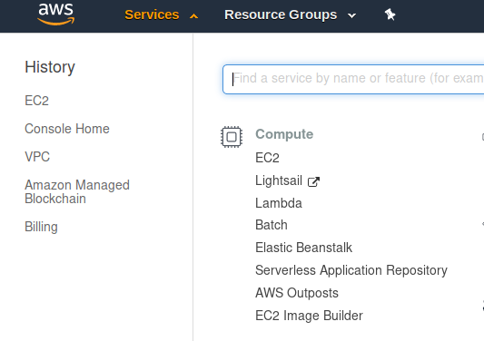
# 3. Then go to **Running Instances** -> **Launch Instance**
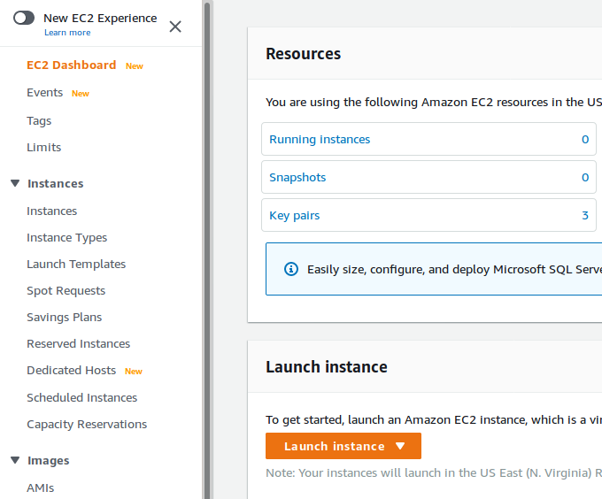

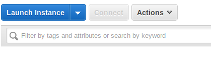
# 4. Select the Ubuntu Image as shown and jump to *Configure Instance*
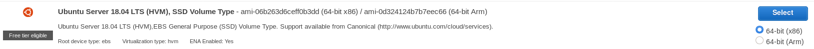

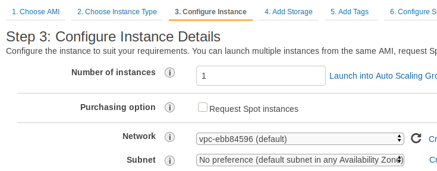
# 5. Go to Bottom of page to **Advanced Details** -> **User data** and paste the Boot Script Code Below
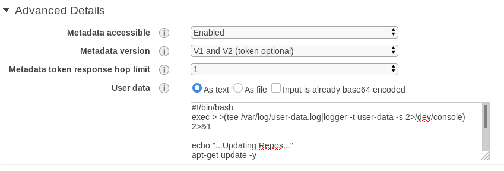
## Boot Script Code

```
#!/bin/bash
exec > >(tee /var/log/user-data.log|logger -t user-data -s 2>/dev/console) 2>&1

echo "...Updating Repos..."
apt-get update -y

echo "...Installing Apache2..."
apt-get install apache2 -y
echo "...Finished Installing Apache2..."

echo "...Installing MySQL..."
apt-get install mysql-server -y
echo "...Finished Installing MySQL..."

echo "...Installing PHP7.2..."
apt-get install php7.2 -y
echo "...Finished Installing PHP7.2..."

echo "...MySQL config..."
mysql -u root -e "GRANT ALL PRIVILEGES ON *.* to 'ubuntu'@'%' IDENTIFIED BY '123' WITH GRANT OPTION; FLUSH PRIVILEGES"
cd /var/www/html
echo "...MySQL config Done..."

echo "...Setting up DVWA..."
git clone https://github.com/digininja/DVWA.git
mv DVWA/ dvwa/
cp dvwa/config/config.inc.php.dist dvwa/config/config.inc.php
sed "20 c\\\$_DVWA[ \'db_user\' ]     = \'ubuntu\';" /var/www/html/dvwa/config/config.inc.php > /var/www/html/dvwa/config/config.txt && mv /var/www/html/dvwa/config/config.txt /var/www/html/dvwa/config/config.inc.php
sed "21 c\\\$_DVWA[ \'db_password\' ] = \'123\';" /var/www/html/dvwa/config/config.inc.php > /var/www/html/dvwa/config/config.txt && mv /var/www/html/dvwa/config/config.txt /var/www/html/dvwa/config/config.inc.php
cd /var/www/html
chmod -R 777 dvwa
echo "...DVWA Setup Done..."

echo "...Setting up SQLi-Dhakkan..."
git clone https://github.com/Rinkish/Sqli_Edited_Version.git
mv Sqli_Edited_Version/sqlilabs/ sqli/
sed "4 c\\\$dbuser =\'ubuntu\';" /var/www/html/sqli/sql-connections/db-creds.inc > /var/www/html/sqli/sql-connections/db-creds-changed.txt && mv /var/www/html/sqli/sql-connections/db-creds-changed.txt /var/www/html/sqli/sql-connections/db-creds.inc
sed "5 c\\\$dbpass =\'123\';" /var/www/html/sqli/sql-connections/db-creds.inc > /var/www/html/sqli/sql-connections/db-creds-changed.txt && mv /var/www/html/sqli/sql-connections/db-creds-changed.txt /var/www/html/sqli/sql-connections/db-creds.inc
echo "...SQLi-Dhakkan Setup Done..."

echo "...Setting up Apache2..."
sed "833 c\allow_url_fopen = On" /etc/php/7.2/apache2/php.ini > /etc/php/7.2/apache2/php.txt && mv /etc/php/7.2/apache2/php.txt /etc/php/7.2/apache2/php.ini
sed "837 c\allow_url_include = On" /etc/php/7.2/apache2/php.ini > /etc/php/7.2/apache2/php.txt && mv /etc/php/7.2/apache2/php.txt /etc/php/7.2/apache2/php.ini
service apache2 restart
echo "...Apache2 Setup Done..."

echo "...Installing phpmyadmin..."
apt-get install phpmyadmin -y
echo "...Full Setup Completed..."
```
> Username for DB: `ubuntu`, Password: `123`
# 6. Add Tags
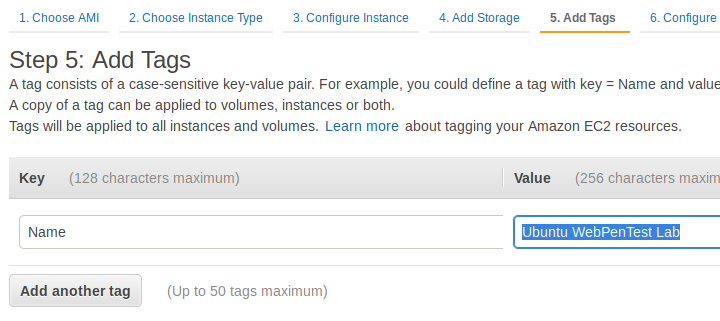
# 7. Add the Security group as shown - SSH, HTTP, ICMPv4, ICMPv6 and **Review and Launch** -> **Launch**
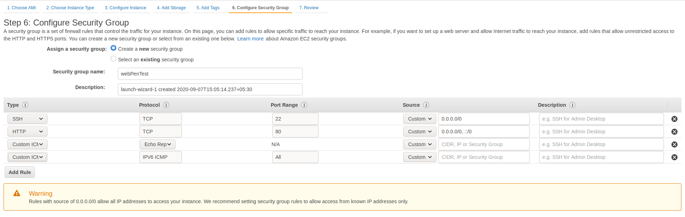

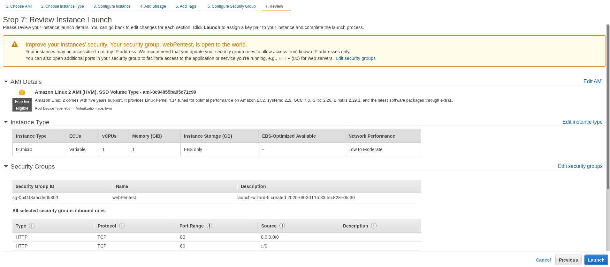
# 8. Download Keypair and Launch Instance
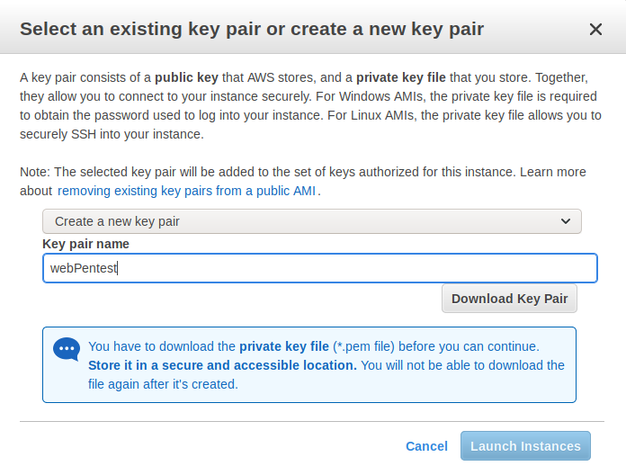
# 9. Wait till the Status Checks Shows All checks done before accessing your machine, else the boot script will not run completely
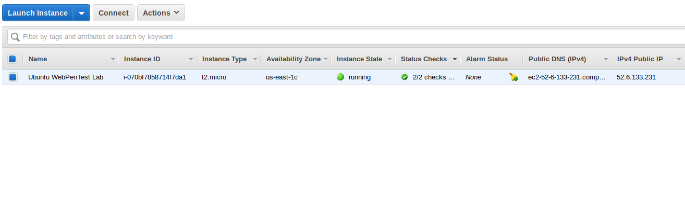
# 10. You can now navigate to *ip*`/dvwa` or *ip*/`sqli` to access dvwa and sqli-dhakkan

### The DVWA will be already ready for labs. You just need to click **Create/Reset Database**
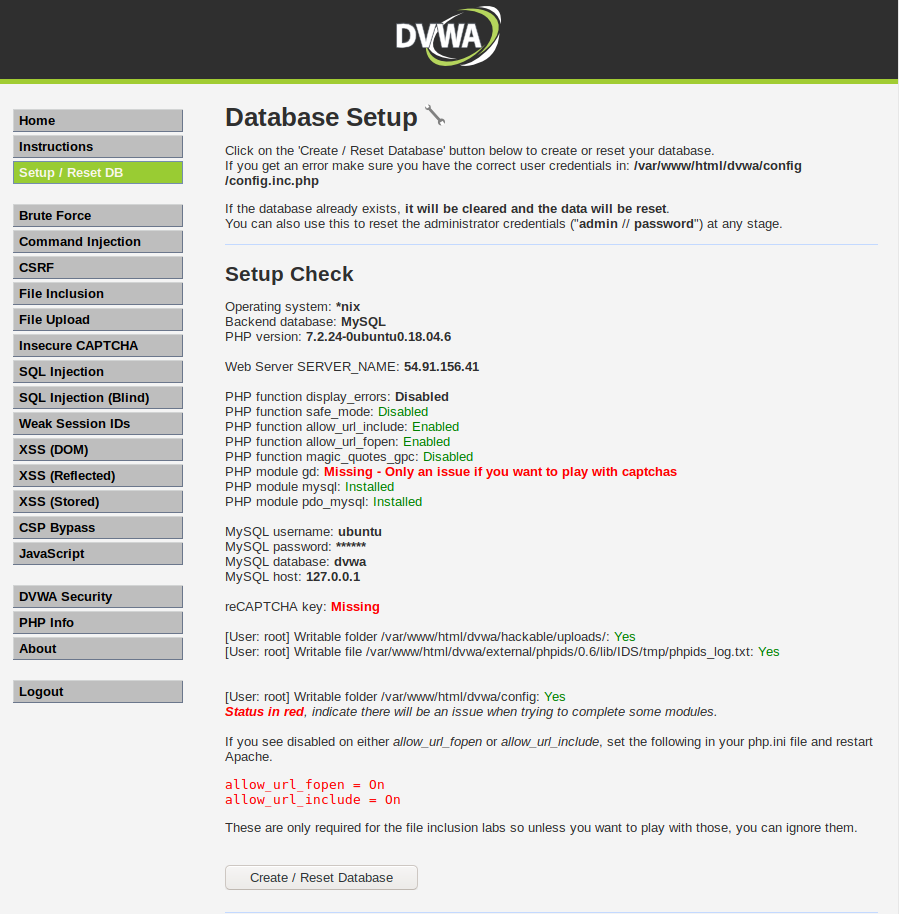

### The sqli-dhakkan will also be ready for practicals
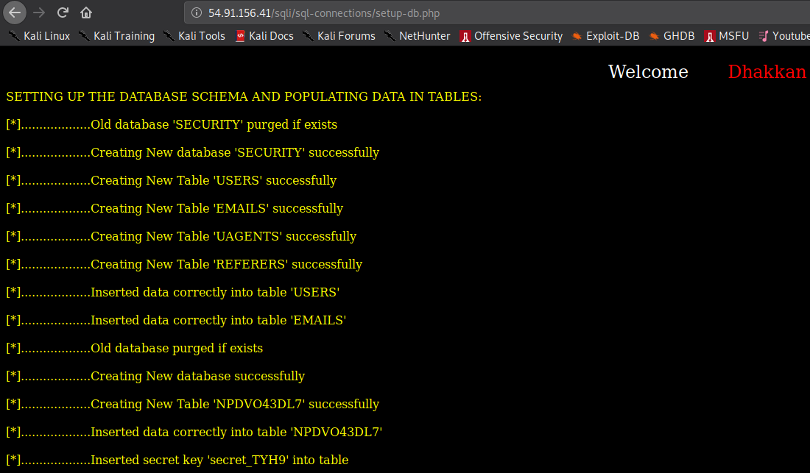
# To View Logs for the Boot Script

`cat /var/log/syslog | grep user-data`

or just to check whether all commands fired

`cat /var/log/syslog | grep "user-data \."`

